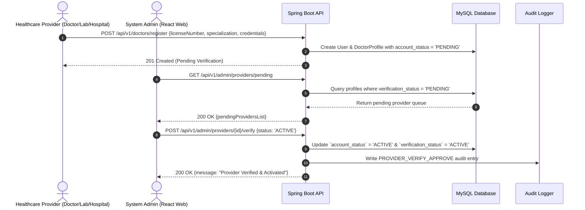

# ADMIN PROVIDER VERIFICATION FLOW MERMAID DIAGRAM

```mermaid
sequenceDiagram
    autonumber
    actor Provider as Healthcare Provider (Doctor/Lab/Hospital)
    actor Admin as System Admin (React Web)
    participant API as Spring Boot API
    participant DB as MySQL Database
    participant Logger as Audit Logger

    Provider->>API: POST /api/v1/doctors/register {licenseNumber, specialization, credentials}
    API->>DB: Create User & DoctorProfile with account_status = 'PENDING'
    API-->>Provider: 201 Created (Pending Verification)

    Admin->>API: GET /api/v1/admin/providers/pending
    API->>DB: Query profiles where verification_status = 'PENDING'
    DB-->>API: Return pending provider queue
    API-->>Admin: 200 OK {pendingProvidersList}

    Admin->>API: POST /api/v1/admin/providers/{id}/verify {status: 'ACTIVE'}
    API->>DB: Update `account_status` = 'ACTIVE' & `verification_status` = 'ACTIVE'
    API->>Logger: Write PROVIDER_VERIFY_APPROVE audit entry
    API-->>Admin: 200 OK {message: "Provider Verified & Activated"}
```
