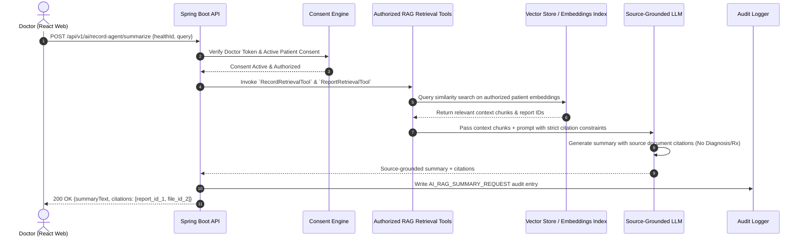

# AI AGENT FLOW MERMAID DIAGRAM

```mermaid
sequenceDiagram
    autonumber
    actor Doctor as Doctor (React Web)
    participant API as Spring Boot API
    participant Consent as Consent Engine
    participant Tools as Authorized RAG Retrieval Tools
    participant VectorDB as Vector Store / Embeddings Index
    participant LLM as Source-Grounded LLM
    participant Logger as Audit Logger

    Doctor->>API: POST /api/v1/ai/record-agent/summarize {healthId, query}
    API->>Consent: Verify Doctor Token & Active Patient Consent
    Consent-->>API: Consent Active & Authorized
    
    API->>Tools: Invoke `RecordRetrievalTool` & `ReportRetrievalTool`
    Tools->>VectorDB: Query similarity search on authorized patient embeddings
    VectorDB-->>Tools: Return relevant context chunks & report IDs
    
    Tools->>LLM: Pass context chunks + prompt with strict citation constraints
    LLM->>LLM: Generate summary with source document citations (No Diagnosis/Rx)
    LLM-->>API: Source-grounded summary + citations
    
    API->>Logger: Write AI_RAG_SUMMARY_REQUEST audit entry
    API-->>Doctor: 200 OK {summaryText, citations: [report_id_1, file_id_2]}
```
