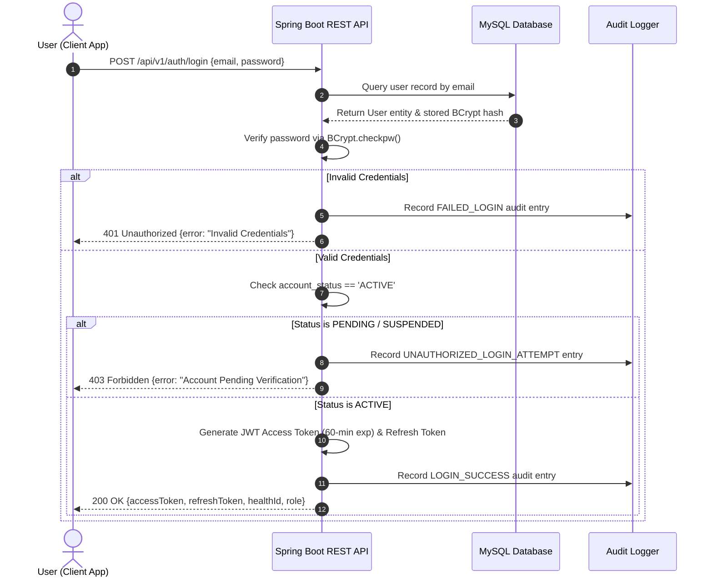

# AUTHENTICATION FLOW MERMAID DIAGRAM

```mermaid
sequenceDiagram
    autonumber
    actor User as User (Client App)
    participant API as Spring Boot REST API
    participant DB as MySQL Database
    participant Logger as Audit Logger

    User->>API: POST /api/v1/auth/login {email, password}
    API->>DB: Query user record by email
    DB-->>API: Return User entity & stored BCrypt hash
    API->>API: Verify password via BCrypt.checkpw()
    
    alt Invalid Credentials
        API->>Logger: Record FAILED_LOGIN audit entry
        API-->>User: 401 Unauthorized {error: "Invalid Credentials"}
    else Valid Credentials
        API->>API: Check account_status == 'ACTIVE'
        alt Status is PENDING / SUSPENDED
            API->>Logger: Record UNAUTHORIZED_LOGIN_ATTEMPT entry
            API-->>User: 403 Forbidden {error: "Account Pending Verification"}
        else Status is ACTIVE
            API->>API: Generate JWT Access Token (60-min exp) & Refresh Token
            API->>Logger: Record LOGIN_SUCCESS audit entry
            API-->>User: 200 OK {accessToken, refreshToken, healthId, role}
        end
    end
```
