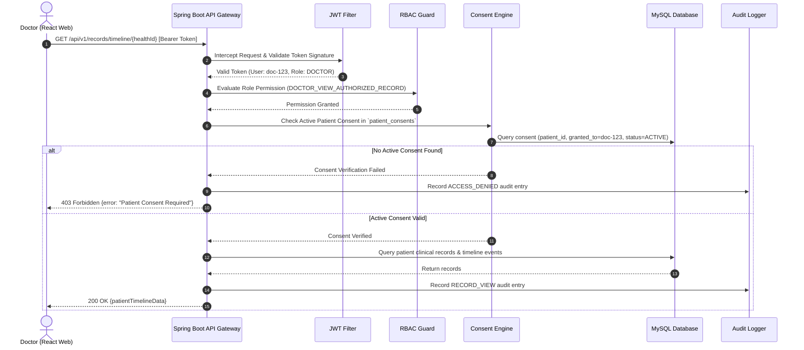

# AUTHORIZATION FLOW MERMAID DIAGRAM

```mermaid
sequenceDiagram
    autonumber
    actor Doctor as Doctor (React Web)
    participant API as Spring Boot API Gateway
    participant JwtFilter as JWT Filter
    participant RbacGuard as RBAC Guard
    participant ConsentEngine as Consent Engine
    participant DB as MySQL Database
    participant Logger as Audit Logger

    Doctor->>API: GET /api/v1/records/timeline/{healthId} [Bearer Token]
    API->>JwtFilter: Intercept Request & Validate Token Signature
    JwtFilter-->>API: Valid Token (User: doc-123, Role: DOCTOR)
    
    API->>RbacGuard: Evaluate Role Permission (DOCTOR_VIEW_AUTHORIZED_RECORD)
    RbacGuard-->>API: Permission Granted

    API->>ConsentEngine: Check Active Patient Consent in `patient_consents`
    ConsentEngine->>DB: Query consent (patient_id, granted_to=doc-123, status=ACTIVE)
    
    alt No Active Consent Found
        ConsentEngine-->>API: Consent Verification Failed
        API->>Logger: Record ACCESS_DENIED audit entry
        API-->>Doctor: 403 Forbidden {error: "Patient Consent Required"}
    else Active Consent Valid
        ConsentEngine-->>API: Consent Verified
        API->>DB: Query patient clinical records & timeline events
        DB-->>API: Return records
        API->>Logger: Record RECORD_VIEW audit entry
        API-->>Doctor: 200 OK {patientTimelineData}
    end
```
