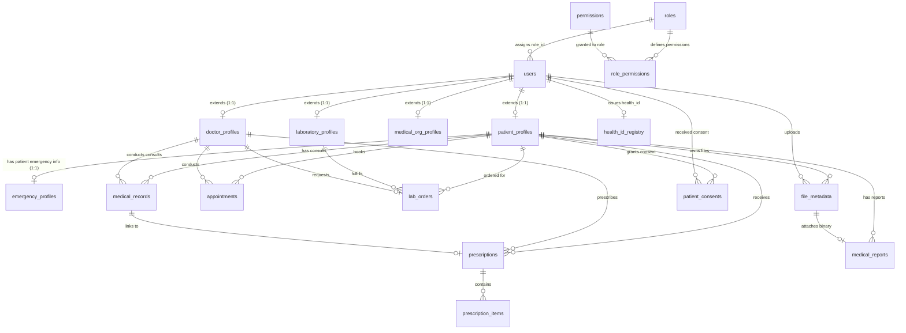

# DATABASE ER DESIGN MERMAID DIAGRAM

```mermaid
erDiagram
    roles ||--o{ users : "assigns role_id"
    roles ||--o{ role_permissions : "defines permissions"
    permissions ||--o{ role_permissions : "granted to role"
    
    users ||--o| patient_profiles : "extends (1:1)"
    users ||--o| doctor_profiles : "extends (1:1)"
    users ||--o| medical_org_profiles : "extends (1:1)"
    users ||--o| laboratory_profiles : "extends (1:1)"
    users ||--o| health_id_registry : "issues health_id"

    patient_profiles ||--o| emergency_profiles : "has patient emergency info (1:1)"
    patient_profiles ||--o{ medical_records : "has consults"
    doctor_profiles ||--o{ medical_records : "conducts consults"
    
    patient_profiles ||--o{ appointments : "books"
    doctor_profiles ||--o{ appointments : "conducts"
    
    patient_profiles ||--o{ prescriptions : "receives"
    doctor_profiles ||--o{ prescriptions : "prescribes"
    medical_records ||--o| prescriptions : "links to"
    prescriptions ||--o{ prescription_items : "contains"
    
    patient_profiles ||--o{ lab_orders : "ordered for"
    laboratory_profiles ||--o{ lab_orders : "fulfills"
    doctor_profiles ||--o| lab_orders : "requests"
    
    patient_profiles ||--o{ medical_reports : "has reports"
    file_metadata ||--o| medical_reports : "attaches binary"
    patient_profiles ||--o{ file_metadata : "owns files"
    users ||--o{ file_metadata : "uploads"
    
    patient_profiles ||--o{ patient_consents : "grants consent"
    users ||--o{ patient_consents : "received consent"
```
