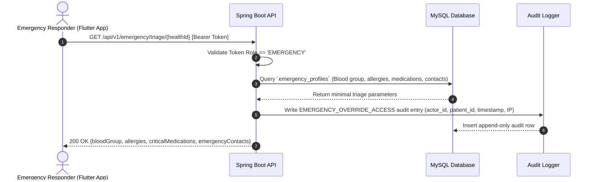

# EMERGENCY FLOW MERMAID DIAGRAM

```mermaid
sequenceDiagram
    autonumber
    actor Responder as Emergency Responder (Flutter App)
    participant API as Spring Boot API
    participant DB as MySQL Database
    participant Logger as Audit Logger

    Responder->>API: GET /api/v1/emergency/triage/{healthId} [Bearer Token]
    API->>API: Validate Token Role == 'EMERGENCY'
    API->>DB: Query `emergency_profiles` (Blood group, allergies, medications, contacts)
    DB-->>API: Return minimal triage parameters
    
    API->>Logger: Write EMERGENCY_OVERRIDE_ACCESS audit entry (actor_id, patient_id, timestamp, IP)
    Logger-->>DB: Insert append-only audit row
    
    API-->>Responder: 200 OK {bloodGroup, allergies, criticalMedications, emergencyContacts}
```
