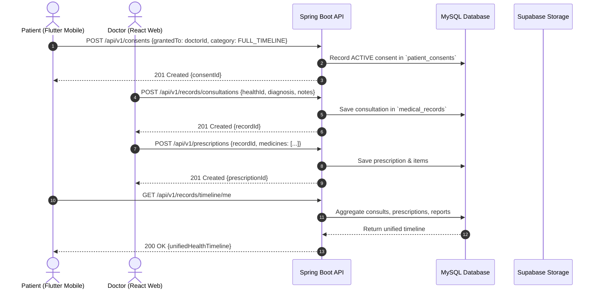

# PATIENT HEALTHCARE FLOW MERMAID DIAGRAM

```mermaid
sequenceDiagram
    autonumber
    actor Patient as Patient (Flutter Mobile)
    actor Doctor as Doctor (React Web)
    participant API as Spring Boot API
    participant DB as MySQL Database
    participant Storage as Supabase Storage

    Patient->>API: POST /api/v1/consents {grantedTo: doctorId, category: FULL_TIMELINE}
    API->>DB: Record ACTIVE consent in `patient_consents`
    API-->>Patient: 201 Created {consentId}

    Doctor->>API: POST /api/v1/records/consultations {healthId, diagnosis, notes}
    API->>DB: Save consultation in `medical_records`
    API-->>Doctor: 201 Created {recordId}

    Doctor->>API: POST /api/v1/prescriptions {recordId, medicines: [...]}
    API->>DB: Save prescription & items
    API-->>Doctor: 201 Created {prescriptionId}

    Patient->>API: GET /api/v1/records/timeline/me
    API->>DB: Aggregate consults, prescriptions, reports
    DB-->>API: Return unified timeline
    API-->>Patient: 200 OK {unifiedHealthTimeline}
```
